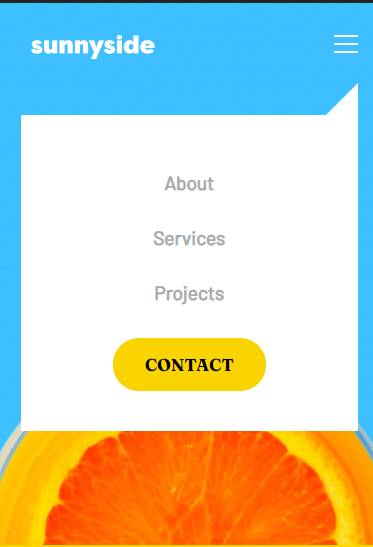
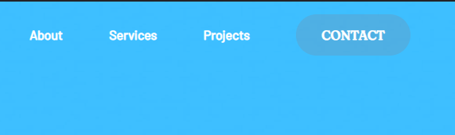
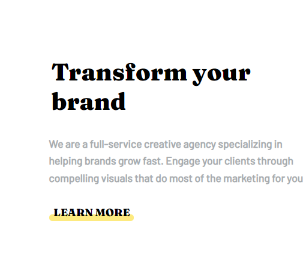

# Frontend Mentor - Sunnyside agency landing page solution

This is a solution to the [Sunnyside agency landing page challenge on Frontend Mentor](https://www.frontendmentor.io/challenges/sunnyside-agency-landing-page-7yVs3B6ef). Frontend Mentor challenges help you improve your coding skills by building realistic projects.

## Table of contents

- [Overview](#overview)
  - [The challenge](#the-challenge)
  - [Screenshot](#screenshot)
  - [Links](#links)
- [My process](#my-process)
  - [Built with](#built-with)
  - [What I learned](#what-i-learned)
  - [Continued development](#continued-development)
  - [Useful resources](#useful-resources)
- [Author](#author)
- [Acknowledgments](#acknowledgments)

## Overview

### The challenge

The challenge is to build out this landing page and get it looking as close to the design as possible.

Users should be able to:

- View the optimal layout for the site depending on their device's screen size
- See hover states for all interactive elements on the page

### Screenshots

Desktop


Mobile


Mobile-menu


Actice-States




### Links

- Solution URL: [Add solution URL here](https://your-solution-url.com)


## My process

### Built with

- Semantic HTML5 markup
- CSS custom properties
- Flexbox
- Sass
- JavaScript


### What I Learned

Building this landing page challenge from frontendmentor was really fun and educational.

This was the first time that i decided to use semantic Html markup in a project, this taught me that using semantic markup makes your website very accessible and user-friendly.

```html
<header>
    <figure>
        <a href="#"></a>
    </figure>
    
    <nav class="navbar">
        <ul>
            <li><a href="#">About</a></li>
            <li><a href="#">Services</a></li>
            <li><a href="#">Projects</a></li>
            <li><a href="#">Contact</a></li>
        </ul>
    </nav>
</header>
```

I've used sass in another project before but it was structured badly and had many lines of code, this time i learned how to use partials to split up your code and make it more structured this way by importing it into the main sass file. Also how to use mixins.

```sass
@import 'variables';
@import 'typography';
@import 'mixins';
@import 'header';
@import 'main-content';
@import 'client-testimonials';
@import 'img-gallery';
@import 'footer';
```

Mixins for media queries
```sass

@mixin for-size($size) {
    @if $size == phone{
        @media (max-width: 375px){
            @content;
        }
    }
    @else if $size == phoneM{
        @media (min-width: 285px) and (max-width: 335px){
            @content;
        }
    }
    @else if $size == phoneL {
        @media (min-width: 340px) and (max-width: 389px){
            @content;
        }
    }@else if $size == tablet{
        @media (min-width: 390px) and (max-width: 720px){
            @content;
        }
    }@else if $size == desktop{
        @media (min-width: 698px) and (max-width: 945px){
            @content;
        }
    }
}

@include for-size(phone){
        .header-wrapper{
            background-image: url("../images/mobile/image-header.jpg");
            height: 95vh;
        }

        .navbar{
            display: none;
        }

        .mobilebtn{
            display: inline;
            padding-top: 1rem;
        }
}
```
Using javascript in this project i learned how to create a dropdown menu for mobile devices
```js
const menuBtn = document.querySelector('.mobilebtn');
const mobilemenu = document.querySelector('.navigationlinks');

menuBtn.addEventListener('click', () => {
  mobilemenu.classList.toggle('open');
});
```

### Continued development

Html
Get better at structuring my website layout.

Css
Get better at using the ::after & ::before pseudo-elements.

Javascript
In general I still want to get better at writing javascript.

### Useful resources

- [MSDN](https://www.msdn.com) - This helped me with pseudo-elements.
- [Example resource 2](https://www.example.com) - This is an amazing article which helped me finally understand XYZ. I'd recommend it to anyone still learning this concept.


## Author

- Frontend Mentor - [@Duran144](https://www.frontendmentor.io/profile/Duran144)
- Github - [Duran144](https://github.com/Duran144)